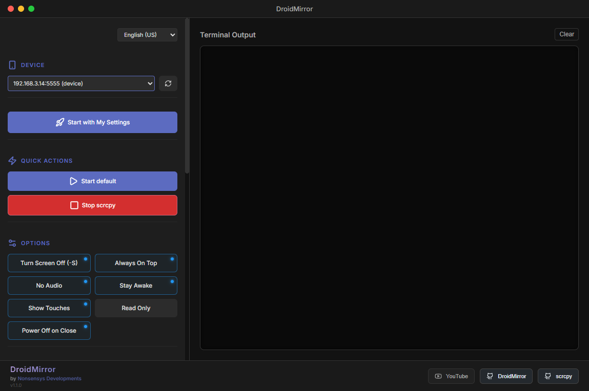
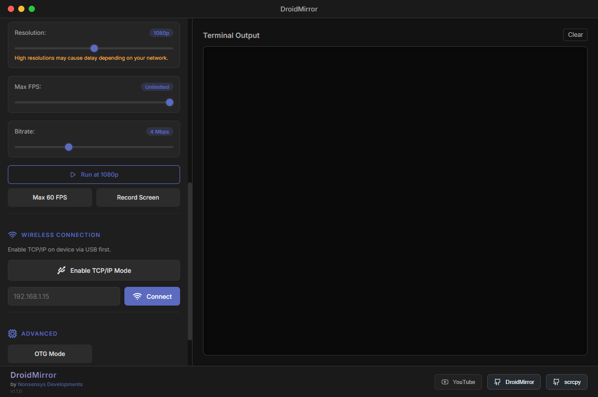

# DroidMirror

[English version below] | [Versão em Português abaixo]




---

## English

**DroidMirror** is a premium Android mirroring and control application based on **Scrcpy**. It provides a user-friendly interface to mirror your device screen, control it with a mouse and keyboard, and manage advanced settings.

### Features
- **High Performance Mirroring**: Low latency screen sharing.
- **Full Control**: Use your computer's mouse and keyboard to control the device.
- **Connection Modes**: Works via USB or Wireless (TCP/IP).
- **Customizable**: Adjust resolution, FPS, and bitrate for the best experience.
- **Advanced Options**:
  - Always on Top
  - Turn screen off while mirroring
  - Stay Awake
  - OTG Mode
  - Screen Recording
- **Internationalization**: Full support for English and Portuguese (pt-BR).

### How to Run
1. Ensure you have [Node.js](https://nodejs.org/) installed.
2. Clone the repository.
3. Install dependencies:
   ```bash
   npm install
   ```
4. Start the application:
   ```bash
   npm start
   ```

---

## Português (Brasil)

**DroidMirror** é um aplicativo premium de espelhamento e controle de dispositivos Android baseado no **Scrcpy**. Ele oferece uma interface amigável para espelhar a tela do seu dispositivo, controlá-lo com mouse e teclado, e gerenciar configurações avançadas.

### Funcionalidades
- **Espelhamento de Alta Performance**: Compartilhamento de tela com baixa latência.
- **Controle Total**: Use o mouse e teclado do computador para controlar o dispositivo.
- **Modos de Conexão**: Funciona via USB ou Wireless (TCP/IP).
- **Customizável**: Ajuste resolução, FPS e bitrate para a melhor experiência.
- **Opções Avançadas**:
  - Sempre no Topo (Always on Top)
  - Desligar tela durante o espelhamento
  - Manter acordado (Stay Awake)
  - Modo OTG
  - Gravação de tela
- **Internacionalização**: Suporte completo para Inglês e Português (pt-BR).

### Como Rodar
1. Certifique-se de ter o [Node.js](https://nodejs.org/) instalado.
2. Clone o repositório.
3. Instale as dependências:
   ```bash
   npm install
   ```
4. Inicie o aplicativo:
   ```bash
   npm start
   ```

---

### Credits
- **Author**: Nonsensys Developments
- **Base Engine**: [Scrcpy](https://github.com/Genymobile/scrcpy)
